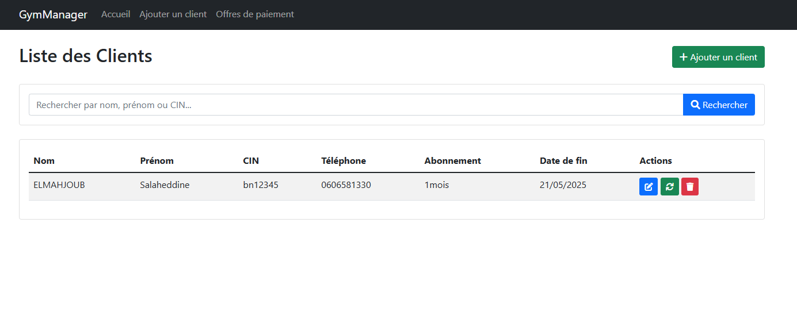
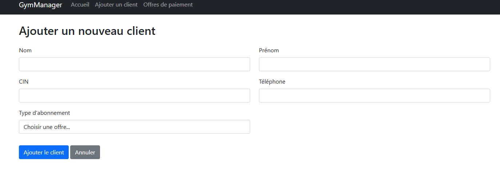
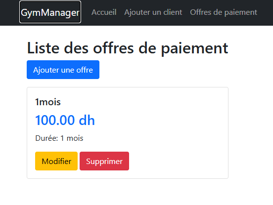

# Application de Gestion de Salle de Sport

Une application web développée avec Flask pour gérer les abonnements et les clients d'une salle de sport.

## Fonctionnalités

- Gestion des clients
- Gestion des offres d'abonnement
- Renouvellement des abonnements
- Interface utilisateur intuitive

## Prérequis

- Python 3.x
- Les dépendances listées dans `requirements.txt`

## Installation

1. Clonez ce dépôt :
```bash
git clone [URL_DU_REPO]
cd [NOM_DU_REPO]
```

2. Installez les dépendances :
```bash
pip install -r requirements.txt
```

3. Lancez l'application :
```bash
python app.py
```
ou utilisez le fichier batch fourni :
```bash
run_app.bat
```

## Structure du Projet

- `/templates` - Contient les templates HTML
- `app.py` - Application principale Flask
- `gym.db` - Base de données SQLite
- `requirements.txt` - Liste des dépendances Python
- `run_app.bat` - Script de lancement rapide

## Captures d'écran

Voici quelques aperçus de l'application :

### Page d'accueil


### Gestion des clients


### Gestion des abonnements


## Technologies Utilisées

- Flask - Framework web
- SQLAlchemy - ORM pour la base de données
- SQLite - Base de données
- Jinja2 - Moteur de templates
- Bootstrap - Framework CSS (via templates)

## Licence

[À définir]
